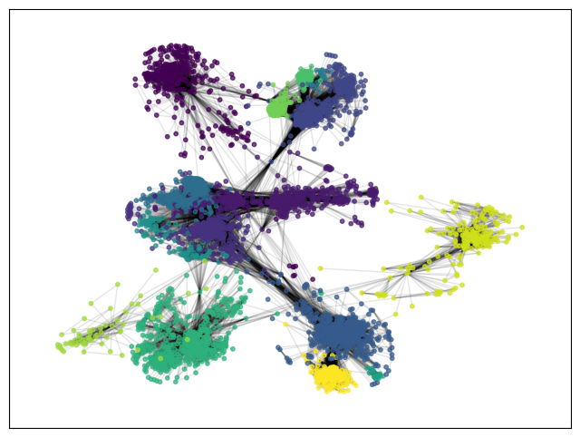

# Social Network Analysis Project



This project is an analysis of a social network using various network analysis techniques and visualization methods. It focuses on examining the Facebook social network to understand its structure, properties, and community dynamics.

## Features

- **Network Visualization**: Generate visual representations of the social network.
- **Adjacency Matrix Heatmap**: Visualize the adjacency matrix of the network.
- **Degree Distribution Analysis**: Analyze and visualize the degree distribution of the network.
- **Clustering Coefficient Analysis**: Compute and visualize the clustering coefficient distribution.
- **Centrality Measures**: Calculate and visualize various centrality measures including eigenvalue centrality, closeness centrality, betweenness centrality, and degree centrality.
- **Community Detection**: Detect and visualize communities within the network using the Louvain method.
- **Information Diffusion Models**: Simulate information diffusion using the Linear Threshold (LT) and Independent Cascade (IC) models.

## Technologies Used

- **NetworkX**: A Python library for the creation, manipulation, and study of complex networks.
- **Matplotlib**: A comprehensive library for creating static, animated, and interactive visualizations in Python.
- **NumPy**: A library for the Python programming language, adding support for large, multi-dimensional arrays and matrices.

## Installation

1. **Clone this repository to your local machine**:

   ```bash
   git clone https://github.com/SamaRostami/Social-Network-Analysis.git
   ```

2. **Change into the project directory**:

   ```bash
   cd social-network-analysis
   ```

3. **Install necessary Python packages**:

   ```bash
   pip install networkx matplotlib numpy
   ```

4. **Download the dataset**:
   Ensure you have the `facebook_combined.txt.gz` file in the project directory.

## Usage

1. **Run Analysis Scripts**: Execute the provided scripts to perform various analyses on the social network dataset.
2. **Generate Visualizations**: Use the scripts to create visual representations and plots to help understand the network's structure.
3. **Explore Centrality Measures**: Examine the centrality measures to identify key nodes within the network.
4. **Community Detection**: Identify and visualize communities to see how the network is divided into subgroups.
5. **Simulate Information Spread**: Use the simulation models to study how information or influence spreads through the network.

## License

This project is licensed under the MIT License.

## Collaborators

- **Samasky Rostami**: You can contact me at `samasky.rostami@gmail.com`.
- **Navid Mafi**: You can find Navid's contributions and projects on GitHub at [Navid Mafi's GitHub](https://github.com/navidmafi).
